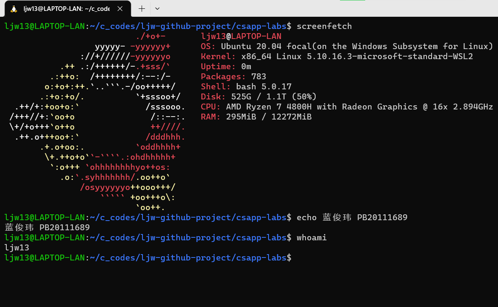

# 计算机系统概论 实验报告

姓名：蓝俊玮 	学号：PB20111689

## 实验摘要

在本课程中，我一共完成了下列 2 个实验：

- Data Lab：实现简单的逻辑、二进制补码和浮点函数
- Shell Lab：使用 job control 实现一个简单 Unix shell 程序

## 实验环境

我使用的是 Windows 下的 WSL2



## 实验介绍

### Data Lab

首先获取实验框架，然后解压：

```bash
wget http://csapp.cs.cmu.edu/im/labs/datalab.tar
tar -xvf datalab-handout.tar
rm datalab-handout.tar
```

同时配置环境：

```bash
sudo apt-get install gcc-multilib
```

#### bitXor 函数

**目标：只使用符号按位非 `~` 和符号按位与 `&` 来实现按位异或 `^`**

学过 “模拟与数字电路 / 011151” 这么课程后，我们知道：
$$
A \oplus B = A\overline{B}+\overline{A}B = \overline{\overline{A\overline{B}} \ \overline{\overline{A}B}}
$$
其中最后一步利用到了德摩根定律：
$$
\overline{A\overline{B}+\overline{A}B}=\overline{A\overline{B}}\ \overline{\overline{A}B}
$$
所以可以得到函数为：

```c
int bitXor(int x, int y) {
  // x ^ y = x & ~y + ~x & y = ~(~(x & ~y) & ~(~x & y))
  return ~(~(x & (~y)) & ~((~x) & y));
}
```

#### tmin 函数

**目标：返回最小二进制补码整数**

我们知道，`int` 的字长为 32 位，而最高位表示的符号位。当最高位为 1 时，则表示为负数。而最小二进制补码整数就是 `0x80000000`。

所以可以得到函数为：

```c
int tmin(void) {
  // minimum two's complement integer is 0x80000000
  return 0x1 << 31;
}
```

#### isTmax 函数

**目标：判断是否为最大二进制补码整数**

同上述，我们知道最大二进制补码整数就是 `0x7fffffff`。因此，我们的目标就是判断输入的数 `x` 是否为该数。为了对其进行判断，我们可以使用 `~(x + 1) ^ x` 对其进行判断。因为 `(x + 1) = 0x80000000, ~(x + 1) = 0x7fffffff, ~(x + 1) ^ x = 0x0`，所以可以通过这个特征鲜明的判断出 `0x7fffffff`。但是注意到 `x = 0xffffffff` 也满足 `~(x + 1) ^ x = 0`，因此还需要对 `0xffffffff` 进行判断。

所以可以得到函数为：

```c
int isTmax(int x) {
  // maximum two's complement number is 0x7fffffff
  // x will overflow when it plus 1, so we use `~(x + 1) ^ x` to judge
  // and to make `~(x + 1) ^ x` work we need to judge 0xffffffff
  // because 0xffffffff also satisfy `~(x + 1) ^ x`
  return !((~(x + 1) ^ x) | !(~x));
}
```

